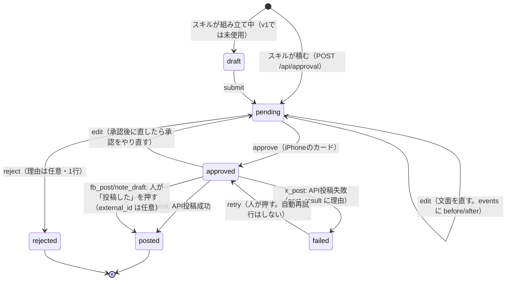

# 承認キュー（approval queue）設計書 v1

作成: 2026-09-19 ／ 状態: **設計のみ（未実装・未適用）**

対になるファイル:
- `supabase/migrations/DRAFT_approval_queue.sql` — テーブル定義の下書き（タイムスタンプ無しなので `supabase db push` の対象にならない。承認後にリネームして適用）
- `docs/approval-queue-api-sketch.md` — 各ルートのリクエスト／レスポンス例と curl ヘルパー

このドキュメントは「設計を合意するためのもの」で、本番には何も入れていない。
既存のアプリコードも触っていない。

---

## 1. 目的

AIが書いた**外へ出るもの**は、必ず次の一本道を通す。

```
AIが書く（スキル／定期タスク） → 積む（approval_queue: pending）
   → 吉井さんが iPhone で見る・直す・承認する
   → 承認済みだけが外へ出る（X API／手動コピー／note 下書き）
```

守りたいのは一つだけ。**AIが人の目を通さずに外へ出す経路をコード上に残さない。**
「投稿はしない」と各スキルの SKILL.md に書いて守らせる現状は、書き忘れた1本で破れる。
関所を1か所に寄せて、そこ以外から投稿できない形にする。

副産物として次が手に入る。
- 何を承認し、何を却下したかが残る（翌日の生成側が読める → 同じ外し方を繰り返さない。夜間参謀の `verdict_note` と同じ考え）
- X の従量課金（1本 $0.015、URL入りは $0.20）を、投稿の前に見積もって月の上限で止められる
- 「承認した文面」と「実際に出た文面」が一致しているかを監査ログで確かめられる

---

## 2. 現状（今日の下書きはどこで作られ、どこに置かれているか）

| 経路 | 生成 | 置き場 | 投稿 | 問題 |
|---|---|---|---|---|
| X「営業AI実践室 転機」(@sales_ai_lab) | `~/.claude/scheduled-tasks/x-sales-ai-lab-morning-draft/SKILL.md`（毎朝7時、3案） | `~/Desktop/AI/X_営業AI実践室/10_AI最新情報_投稿文.md` に追記 ＋ `09_投稿ログ.md` に「投稿案作成済」 | 吉井さんが手でXアプリに貼る | 案がMDファイルに溜まるだけで、iPhoneから見られない。どの案を採ったかが `09_投稿ログ.md` の手更新頼み |
| ラーメンX (@0kara1_man) | `/api/ramen/draft`（`lib/ramen.ts` の型でLLM生成） | `ramen_logs.draft_x` | `/api/ramen/post-x`（画面のボタン＝人が押す） | **すでに「人がボタンを押す」形なので今回の関所と同等**。ただし承認の記録は `x_url` の有無だけで、却下・編集の履歴は無い |
| X監視ダイジェスト | `x-digest-collect` スキル → `x-digest-put.py` | `x_digest_items` | 投稿しない（/news に表示するだけ） | 対象外（外へ出ない）。ただし**ネタ元**として `source_ref` に使える |
| Facebook / note.com | 無し（コードに一切出てこない） | — | — | 今後 AI に書かせるなら、最初からこの関所を通す |
| メール / カレンダー | Gmail・Calendar の MCP がある | — | MCP から直接送れてしまう | v1 では kind だけ予約。送信の実装はしない（§10） |

つまり今日の実態は「自動投稿しているものは無い（ラーメンだけ人がボタンを押して投稿）」。
危ないのは、**次に作るスキルが SKILL.md の「投稿はしない」を書き忘れたとき**で、
関所を作るのは今のうちが安い。

### 投稿先ごとの制約（2026-09 調査）

| 先 | 自動投稿 | 根拠・制約 |
|---|---|---|
| X | **可**（API v2、従量課金のみ） | 1本 $0.015、本文にURLが入ると $0.20。自動投稿するアカウントは設定で **Automated ラベル**を有効にする必要あり。ブラウザ自動操作は規約違反なので Playwright（プレイライト）では絶対にやらない |
| Facebook 個人プロフィール | **不可**（API は Page 専用） | 承認カードに「コピーして手動投稿」を置く。それ以上はやらない |
| note.com | **不可**（書き込みAPI無し） | Playwright で**下書き保存まで**。公開は必ず人が note の画面で押す |
| Buffer | 可（公式 MCP + GraphQL、無料枠あり） | **v1 では使わない**。複数チャネルへ同じ文を出す段になったら v2 の選択肢（§11） |

---

## 3. テーブル設計

正は `supabase/migrations/DRAFT_approval_queue.sql`。ここでは考え方だけ。

### 3-1. `approval_queue`

| 列 | 型 | 意味 |
|---|---|---|
| `id` | uuid | PK |
| `kind` | text (CHECK) | `x_post` / `fb_post` / `note_draft` / `email` / `calendar` |
| `status` | text (CHECK) | `draft` / `pending` / `approved` / `rejected` / `posted` / `failed` |
| `title` | text | カード1行目。X は本文先頭、note は記事タイトル |
| `body` | text | **人が編集する正本** |
| `body_json` | jsonb | 投稿先の構造。X: `{thread[], media[], quote_tweet_id, has_url, weighted_len, account}` |
| `source` | text | 積んだスキル名 |
| `source_ref` | text | 元ネタ `表名:ID`（`insights:<uuid>` / `ramen_logs:123` / `x_digest:2026-09-18`）。二重起票の判定に使う |
| `scheduled_for` | timestamptz | 予約投稿。null なら承認後すぐ |
| `approved_at` / `approved_by` | | `approved_by` は端末・経路（`iphone-card` / `cli`）。単独運用なので人名は持たない |
| `rejected_at` / `reject_note` | | 却下理由。翌日の生成プロンプトに差し込める（`verdict_note` と同じ役） |
| `posted_at` / `external_id` / `post_result` | | 投稿の証跡。`posted` なのに証跡が無い行は CHECK で作れない |
| `cost_usd` | numeric(8,4) | 積む時に見積もり、投稿時に確定 |
| `post_lock` | text | 二重投稿防止の専用列（`ramen_logs.x_post_lock` と同じ思想） |
| `created_at` / `updated_at` | | `updated_at` は baseline の `set_updated_at()` トリガ |

**enum 型ではなく text + CHECK にした理由。** リポジトリの全テーブル（`integration_jobs.kind` / `insights.kind` / `ask_log.rating`）がこの作法で、Postgres の enum 型は1つも使っていない。値を足すとき `ALTER TYPE` より CHECK の張り替えのほうが rollback が書きやすい。

**`draft` と `pending` を分ける理由。** スレッド＋画像のように複数ステップで組み立てる場合、途中の行がカードに出ると「未完成のものを承認」が起きる。v1 のスキルは一発で `pending` として積んでよく、`draft` は将来の多段組み立て用に予約しておく。

### 3-2. `approval_queue_events`（監査ログ）

`queue_id` / `event`（created / submitted / edited / approved / rejected / posting / posted / failed / copied / retried） / `actor` / `detail` jsonb / `note` / `created_at`。

行は最新状態しか持たないので、**「承認した文面」と「出た文面」が同じか**はここでしか確かめられない。
`copied` を入れるのは、fb_post のように API を通らないものが「外に出た可能性がある」時刻を残すため。消さない。

### 3-3. RLS（ロウレベルセキュリティ）

ポリシー無し・`service_role` のみ（`insights` / `ask_log` と同じ）。
`integration_jobs` は anon SELECT を許しているが、こちらは外に出す前の文面と投稿先の識別子を持つので anon に読ませない。画面は Next.js の API（合言葉 cookie）経由。

---

## 4. 状態遷移



決めごと:
- **承認後に編集したら `pending` に戻す。** 承認した文面と違うものが出るのを構造で防ぐ。
- **`failed` からの自動再試行はしない。** 残高切れ・キー失効は待っても直らない。人が `retry` を押す（夜間参謀 §9-5 と同じ線引き）。
- `rejected` と `posted` は終端。直したいなら新しい行を積む（`source_ref` に元の `approval_queue:<id>` を入れて系譜を残す）。

---

## 5. API ルート

すべて `app/api/approval/` 配下。認証は既存2種の組み合わせ（`notion-sync` / `night-advisor` と同じ関数を `lib/approval/auth.ts` に切り出して共用）:
- `Authorization: Bearer <CRON_SECRET>` … Claude Code スキル・launchd・Vercel Cron から
- 合言葉 cookie `aiworkos_auth` … iPhone / Mac のブラウザから

| ルート | 誰が | すること |
|---|---|---|
| `GET /api/approval` | カード | `status=pending` を新しい順（＋直近3日の approved/posted/failed/rejected を履歴として。`RECENT_DAYS` は `/api/jobs` と同じ3日） |
| `POST /api/approval` | スキル | 1件積む。サーバ側で X の加重文字数・URL有無・`cost_usd` を計算して保存。`source`+`source_ref` が既に pending/approved にあれば 409（二重起票防止） |
| `POST /api/approval/[id]/approve` | カード | `pending → approved`。`kind=x_post` で `scheduled_for` が無ければ**その場で投稿まで行う**（§5-1）。fb/note はステータスを変えるだけ |
| `POST /api/approval/[id]/reject` | カード | `pending → rejected`。`note` 任意 |
| `POST /api/approval/[id]/edit` | カード | `body`（と `body_json.thread`）を差し替え。加重文字数を再計算。`approved` なら `pending` に戻す |
| `POST /api/approval/[id]/mark-posted` | カード | fb_post / note_draft を人が外に出したあと `posted` にする。`external_id`（投稿URL）任意 |
| `POST /api/cron/approval-post` | Vercel Cron／launchd | `approved` かつ `scheduled_for <= now()`（または null で approve 時に投稿できなかったもの）の x_post を投稿。`note_draft` は Mac ワーカーが拾う（§5-2） |

### 5-1. 「承認＝投稿」にする理由と、cron の役割

Vercel Hobby の Cron は**1日1回**しか組めない（`vercel.json` の既存2本もどちらも日次）。
「朝承認して、夕方の cron まで出ない」では承認の意味が薄い。
承認ボタンを押す瞬間は人がそこにいるので、**approve ルートが X API まで一気に叩く**
（`/api/ramen/post-x` が今やっていることと同じ。所要は数秒で 60 秒の壁に当たらない）。

cron は「保険と予約」だけを担う:
- `scheduled_for` 入りの予約投稿
- approve 時に X API が一時失敗（429/5xx）して `approved` のまま残ったもの
- 時刻は日次 `0 22 * * *`（UTC）＝ JST 7:00。Mac の launchd で毎時回してもよいが、v1 では日次だけ

投稿処理の本体（ロック取得→投稿→書き戻し→events）は `lib/approval/post.ts` に1本だけ書き、approve と cron の両方から呼ぶ。**同じ規則を2か所に書かない**（production-change-protocol の恒久注意）。

### 5-2. kind ごとの投稿の扱い

| kind | approve 後 | posted にする者 |
|---|---|---|
| `x_post` | `lib/approval/post.ts` → `lib/x.ts` の `postTweet` / `uploadMedia`。スレッドは順に `reply.in_reply_to_tweet_id` で繋ぐ | API（自動） |
| `fb_post` | 何もしない。カードに **「コピーして手動投稿」** ボタン（`navigator.clipboard.writeText`、`app/ramen/page.tsx` と同じ）。押したら events に `copied` | 人が「投稿した」を押す |
| `note_draft` | Mac 側ワーカーが `status=approved&kind=note_draft` を PostgREST で直接ポーリングし、Playwright で note の下書き保存まで行い、`post_result.note_draft_url` を書いて `posted`（意味は「下書きに置いた」。公開は人） | ワーカー |
| `email` / `calendar` | v1 では fb_post と同じ扱い（コピーのみ）。送信の自動化は別設計 | 人 |

**note_draft を `integration_jobs` に流さない理由。** `integration_jobs.kind` の CHECK は `eight/plaud/slides/proposal` に固定されていて、足すには本番の制約を張り替える必要がある。承認キュー自体が「approved の note_draft を拾え」というジョブ表になるので、ワーカー（`integration-worker` スキルの `jobs.py` に `approval` サブコマンドを足す想定）が直接見に来れば足りる。

### 5-3. X のアカウントが2つある問題

`lib/x.ts` は `X_USERNAME = "0kara1_man"`（ラーメン）を定数で持ち、環境変数も1組（`X_API_KEY` …）。
`@sales_ai_lab` に投稿するにはもう1組のキーが要る。

- `body_json.account`（`ramen` / `sales_ai_lab`）でアカウントを選ぶ
- 環境変数は接頭辞で分ける: `X_SALES_API_KEY` / `X_SALES_API_SECRET` / `X_SALES_ACCESS_TOKEN` / `X_SALES_ACCESS_TOKEN_SECRET`
- `lib/x.ts` の `xCreds()` に `account` 引数を足す（既定はラーメンのまま。既存の `/api/ramen/post-x` の挙動は変えない）
- `X_USERNAME` も `account` ごとの表にする

これは既存 `lib/x.ts` への変更なので、実装段階で Shadow（並走）の対象。

---

## 6. ホーム画面カード

`app/components/ApprovalCard.tsx` を1枚。`NightInsightCard` の構造をそのまま流用する。

- 位置: `app/page.tsx` の `<AdvisorCard>` の**上**（人の操作を要するものを、事実→仮説の前に置く）。`onPendingCount` で件数を上の赤帯へ上げる（`AdvisorCard` の `onAlertCount` と同じ渡し方）
- 出し分け: `pending` が0件かつ直近3日の履歴も無ければ**カードごと出さない**（`NightInsightCard` と同じ。「承認待ちはありません」を毎朝出すと読まれなくなる）
- 1件の見た目（iPhone幅で親指1本）:

```
┌────────────────────────────────────────────┐
│ [X] 営業AI実践室    見積 $0.015  238/280   │  ← kind チップ／コスト／加重文字数
│ 🧠 まだ議事録、手で要約してますか？…        │  ← title（本文先頭）
│ （本文全文。タップで折りたたみ解除）          │
│ 出典: x-sales-ai-lab-morning-draft ／ 9/19 │
│ [ 承認して投稿 ] [ 直す ] [ 却下 ]           │  ← 3ボタン。承認は emerald、却下は rose
└────────────────────────────────────────────┘
```

- **承認して投稿** … 押す前に1回だけ `confirm()` で「$0.015 で @sales_ai_lab に投稿します」。URL入りなら **$0.20 と赤字**で出す
- **直す** … その場で `<textarea>` を開き、保存で `/edit`。文字数は入力中に出す（加重280超は保存ボタンを無効化）
- **却下** … 押したら1行の理由欄が出る（任意・空でも通す）。夜間参謀の「的外れ」と同じ摩擦の少なさ
- fb_post / note_draft の場合、「承認して投稿」の代わりに **「承認」→「コピーして手動投稿」→「投稿した」** の順にボタンが変わる
- `failed` の行は理由（`post_result.error`）と **「再試行」** を出す
- スレッドは本文を「1/3」「2/3」で区切って表示。編集はスレッド単位

E2E（`tests/e2e/`）は night-insight.spec.ts と同じく「実データでカードが描画される」ことだけ固定し、書き込みは出さない。

---

## 7. Claude Code 側（スキルがどう積むか）

### 7-1. `~/.local/bin/approval-enqueue.sh`（仕様）

```
使い方: approval-enqueue.sh <kind> <source> <本文ファイル> [--title "…"] [--ref "表:ID"] [--json <body_json.json>] [--at "2026-09-20T07:00:00+09:00"] [--line]
```

- 秘密は `~/.config/aiworkos/approval.env`（`AIWORKOS_URL` と `CRON_SECRET` の2行）から読む。**スクリプトにも SKILL.md にも値は書かない**（`notion-sync.sh` が `.env.local` を直読みしているのは cookie 方式の名残で、こちらは真似しない）
- `POST $AIWORKOS_URL/api/approval` を `Authorization: Bearer $CRON_SECRET` で叩く
- 応答の `id` と `weighted_len` / `cost_usd` を標準出力に出す（スキルはそれをチャットに貼る）
- `--line` を付けたときだけ `~/.config/salt2-line/send-line.sh` で LINE に「承認待ち1件：<title> → <AIWORKOS_URL>/#approval-card」を送る
- `with-heartbeat.sh approval-enqueue …` で包める形にする（定期タスクから使うときは包む）
- 400/409 はそのまま終了コード非0で返す。**サーバの検証（280超・URL入り・二重起票）で落ちた理由をスキルに戻す**のが役目で、スクリプト側で文字数を数え直さない（数える規則は `lib/x.ts` の1か所）

### 7-2. 既存スキルの変え方（v1）

| スキル | 変更 |
|---|---|
| `x-sales-ai-lab-morning-draft` | §5「出力」に1行足す: 3案のうち**推し1案**を `approval-enqueue.sh x_post x-sales-ai-lab-morning-draft /tmp/x-draft.txt --ref "x_digest:<日付>"` で積む。MDファイルへの追記と `09_投稿ログ.md` は**当面そのまま**（Shadow 期間は両方に書き、キューが信用できてから MD を止める） |
| ラーメン `/api/ramen/post-x` | **触らない。** 既に人がボタンを押す形。キューへ寄せるのは v2 |
| 新規スキル（FB / note） | 最初から enqueue のみ。SKILL.md に「投稿しない」と書くだけでなく、**投稿する手段を持たせない** |

### 7-3. PreToolUse フック（エージェントからの直接投稿を拒否する）

`~/.claude/settings.json` の `hooks.PreToolUse` には今 `^mcp__` を `log-mcp-calls.py` に流す1本だけがある。ここに **Bash 用の拒否フック**を1本足す案:

```json
{
  "matcher": "Bash",
  "hooks": [{ "type": "command", "command": "/Users/YOSHII/.local/bin/deny-direct-post.py", "timeout": 5 }]
}
```

`deny-direct-post.py` は stdin の `tool_input.command` を読み、次に当たれば
`{"hookSpecificOutput":{"hookEventName":"PreToolUse","permissionDecision":"deny","permissionDecisionReason":"外への投稿は approval_queue 経由（approval-enqueue.sh）で"}}` を返す:

- `api.x.com/2/tweets` / `api.twitter.com` を含む `curl`・`python`・`node`
- `/api/ramen/post-x` / `/api/approval/*/approve` / `/api/cron/approval-post` への `curl`（承認は人が画面で押す。エージェントが自分で承認できたら関所の意味が無い）
- `graph.facebook.com` への POST

あわせて `^mcp__.*(gmail|send_message|create_event)` 系を同じ拒否にするかは §12 の未決事項（今は Gmail MCP の `send_message` を Claude が直接叩けてしまう）。

このフックは「守りの2枚目」で、1枚目は「スキルが投稿手段を持たない」こと。フックだけに頼らない。

---

## 8. 通知

| タイミング | 手段 | 実装 |
|---|---|---|
| 積まれた（pending） | **LINE**（`~/.config/salt2-line/send-line.sh`） | `approval-enqueue.sh --line`。Mac 側で送る（定期タスクは Mac で走るため） |
| 積まれた（pending） | **Push**（`lib/pushNotify.ts` の `sendPushToAll`） | `POST /api/approval` に `notify: true` があれば送る。LINE と二重にしない（v1 は LINE を既定、Push は `notify` 明示時のみ） |
| 投稿できた／失敗した | Push | `lib/approval/post.ts` の結果で `sendPushToAll`。失敗時のみ必須（成功は画面で分かる） |
| 承認待ちが24時間放置 | 朝の Push（`/api/cron/daily-todo`） | `pending` の最古が24時間超なら通知文に1行足す。**日記の途絶検知と同じ段落に載せる**（新しい通知経路を作らない） |
| ジョブの心拍 | `job_heartbeats` | `approval-post` を `WATCHED_JOBS` に `staleHours: 48` で追加（Cron が日次で、Mac 閉じでも走る Vercel 側なので 36 でもよい） |

Claude Code 自身への Push 通知（デスクトップ通知）は、スキルが積んだ直後にチャット本文へ id と本文を貼ることで代える（`x-sales-ai-lab-morning-draft` の「ファイルに書いただけで終わらせない」と同じ規律）。

---

## 9. コスト管理（X）

- 見積もり規則は **`lib/x.ts` に1か所**: `estimateCostUsd(text) = hasUrl(text) ? 0.20 : 0.015`。URL 判定は `https?://` と `t.co` に加え、X が自動リンクにする `example.com` 形式のドメイン風文字列も当てる（保守的に高く見積もる）
- `POST /api/approval` で見積もって `cost_usd` に入れ、カードに出す。**URL入りは赤字**
- 月の上限: 環境変数 `X_MONTHLY_CAP_USD`（既定 `3.00`）。`lib/approval/post.ts` は投稿前に `sum(cost_usd) where kind='x_post' and status='posted' and posted_at >= 今月1日(JST)` を引き、超えるなら投稿せず `failed`（`post_result.error = "月の上限"`）にして Push
- 投稿成功後、`cost_usd` を確定値で上書き（X の応答に金額は無いので規則で再計算。実請求は X コンソールの「請求サイクル上限 $10」が最後の壁）
- スレッドは1本ごとに課金されるので `thread.length` 倍
- 月次で `x_post_metrics` の取り込み（`x-analytics-import.py`）と突き合わせ、`external_id` と `post_id` が一致することを見る（ラーメン分だけでなく sales_ai_lab 分も入るようにするのは別件）

---

## 10. 導入手順（production-change-protocol に沿う）

チェックリストは `~/.claude/skills/production-change-protocol/CHECKLIST.md` を使う。ここではこの案件に固有の内容。

### 関門1: 実データ確認（READ ONLY）
- `x_digest_items` / `insights` の直近30日の件数（`source_ref` の候補が実在するか）
- `~/Desktop/AI/X_営業AI実践室/09_投稿ログ.md` で、直近30日の「投稿案作成済」と「投稿済」の本数（＝1日あたりの承認負荷の実測）
- `ramen_logs` で `x_url IS NOT NULL` の月あたり本数（コスト上限の初期値の根拠）
- `push_subscriptions` の行数（Push が届く端末があるか）

### 関門2: Shadow（積むだけ・投稿しない）
- `DRAFT_approval_queue.sql` をリネームして適用（テーブル追加のみ。既存表は触らない）
- `GET/POST /api/approval`、`approve/reject/edit`、カードを入れる。**`lib/approval/post.ts` は `APPROVAL_POSTING_ENABLED` が `true` でなければ何もせず `approved` のまま返す**（フェイルクローズ。`xCreds()` が無いと 503 を返す `/api/ramen/post-x` と同じ倒し方）
- `x-sales-ai-lab-morning-draft` に enqueue を足す。MD への追記は残す（両方に書く）
- **7日間**、毎朝カードで承認／却下／編集を実際に押す。見るもの: 承認率、編集率、カードを開くまでの時間、二重起票が起きないか
- この間、投稿は今までどおり手で行う（キューの `approved` と実投稿を人が突き合わせる）

### 関門3: テスト
- `lib/x.ts` の `weightedLength` / `estimateCostUsd` / `hasUrl` と、`lib/approval/transition.ts`（状態遷移の許可表）を純粋関数にして `tests/approval.mjs` に固定、`run-all.mjs` に組み込む
- **アサーションを足したら、わざと壊して落ちることを確かめる**（`check(label, 真偽値)` の空振り事故の再演防止）
- E2E: `tests/e2e/approval.spec.ts` でカードが実データで描画されること（書き込み無し）

### 関門4: 本番（1つずつ）
- `X_SALES_*` の4キーを Vercel に入れる（`@sales_ai_lab` 側は先に X の設定で **Automated ラベル**を有効にする）
- `X_MONTHLY_CAP_USD=1.00` で始める（Golden の1本＋余裕）
- `APPROVAL_POSTING_ENABLED=true` を入れる。**これが唯一の切り替え**

### 関門5: Golden
- 承認済み1件を `approve`（post:true）で投稿 → X で実物を開き、`external_id` の tweet と `body` が**1字も違わない**ことを確認（`events` の `approved.detail.body` と `posted.detail.text` の一致もこれで見る）
- 同じ行にもう一度 approve を叩いて 409 が返ること（`post_lock` の排他）
- `cost_usd` が `0.015`（URL無し）で確定していること
- 1本で止める。2本目以降は翌日以降の通常運用

### 関門6: rollback
- 投稿を止める: `APPROVAL_POSTING_ENABLED` を外す（DB を触らない。行は `approved` に留まり、カードは「投稿は停止中」を出す）
- スキルの enqueue を止める: SKILL.md の1行を消す（MD への追記は残っているので下書きは失われない）
- 表ごと戻す: `DROP TABLE approval_queue_events; DROP TABLE approval_queue;`（他の表に触っていないのでこれだけ）
- `proxy.ts` の `PUBLIC_PATHS` に足した `/api/cron/approval-post` の1行を消す

---

## 11. v2 で考えること（v1 では意図的にやらない）

- **Buffer**（バッファ）: 公式 MCP + GraphQL。X と（Page なら）Facebook を1本の承認で同時に出せる。ただし個人プロフィールは Buffer でも不可なので、吉井さんの FB の使い方次第。無料枠で十分か、キューの `kind` に `buffer` を足すだけで済むかを、v1 で1か月回してから判断
- ラーメン `/api/ramen/post-x` をキューに寄せる（今は独自の `x_post_lock` を持つ。二重管理を1本にできる）
- `email` / `calendar` の送信・登録の自動化（今は kind だけ予約）
- 承認・却下の履歴を翌朝の生成プロンプトへ差し込む（`reject_note` を読ませる。夜間参謀の `verdict_note` と同じ形）
- `x_post_metrics` に `@sales_ai_lab` 分も取り込み、`external_id` で反応を紐づける

---

## 12. 未決事項（吉井さんに聞く）

1. **@sales_ai_lab の X 開発者キー**を新たに取るか（ラーメンと別アプリ・別課金になる。Automated ラベルの設定も要る）
2. **承認＝投稿**でよいか。それとも「承認」と「投稿」を別ボタンにするか（ボタンが1つ増えるが、承認だけして夜に出す使い方ができる。`scheduled_for` でも同じことはできる）
3. **月の上限の初期値**（$1 / $3 / $5）。実測（関門1）を見てから決めてもよい
4. Gmail / Calendar の MCP を Claude Code から直接叩けてしまう現状を、PreToolUse フックで**今すぐ塞ぐか**（塞ぐと、吉井さんが「このメール送っといて」と頼んだときも一度キューを通ることになる）
5. Facebook は個人プロフィールのままか、Page を作る予定があるか（Page ならAPI投稿が可能になり、fb_post の扱いが x_post 側に寄る）
6. `09_投稿ログ.md` の「投稿済」更新を、`posted` になった時点で自動追記させるか（Mac 側ワーカーが `posted` を拾って MD に書く。MD とキューのどちらを正にするか）
7. `CRON_SECRET` を Mac の `~/.config/aiworkos/approval.env` に置くことの可否（今は `.env.local` にしか無い。`notion-sync.sh` は合言葉から cookie を作る別方式）

---

## 13. 設計時に見つけた、リポジトリの作法とのずれ・注意

| 項目 | 実態 | 設計での扱い |
|---|---|---|
| enum | 依頼文は「kind enum / status enum」だが、リポジトリは全て text + CHECK | text + CHECK に合わせた |
| `updated_at` トリガ | baseline に共通の `set_updated_at()` あり（health_metrics / salt2_members が使用）。表ごとに専用関数を書いている箇所（legislator_notes 等）もある | 共通関数を使う。新しい関数は書かない |
| RLS | 新表は `ensure_rls` イベントトリガで自動有効。`integration_jobs` は anon SELECT 許可、`insights` / `ask_log` はポリシー無し | ポリシー無し（文面を anon に読ませない） |
| GRANT | 既存マイグレーションに `GRANT` 文は無い（Supabase 既定のロール権限に任せている） | 書かない |
| Cron | Vercel Hobby は日次のみ。LLM を呼ぶ長い処理は launchd | X 投稿は数秒なので Vercel でよい。ただし approve 時に即投稿を主にし、cron は保険 |
| 認証 | ルートごとに `authorized()` を**コピーして**持っている（notion-sync / night-advisor / ramen の3か所に同じ関数） | `lib/approval/auth.ts` に切り出す。既存3か所を寄せるかは別件（「同じ規則を2か所に書かない」に照らすと寄せたい） |
| `proxy.ts` | Cron のパスは `PUBLIC_PATHS` に手で足す必要がある | `/api/cron/approval-post` を1行足す（既存コード変更。実装時） |
| `lib/x.ts` | アカウント1つ前提（`X_USERNAME` 定数・env 1組） | `account` 引数を足す。既定はラーメンで既存挙動は不変 |
| `integration_jobs.kind` | CHECK が4値固定 | 触らない。note_draft はキューを直接ポーリング |
| Mac 側スクリプトの認証 | `x-digest-put.py` は service role で PostgREST 直叩き、`notion-sync.sh` は合言葉→cookie | ヘルパーは `CRON_SECRET` で API 経由（検証をサーバ1か所に寄せるため）。service role 直叩きだと 280 超や URL 入りを弾けない |
| ID 型 | `integration_jobs` / `insights` は uuid、`ramen_logs` は bigint | uuid |
